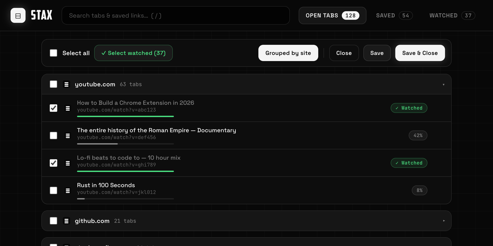
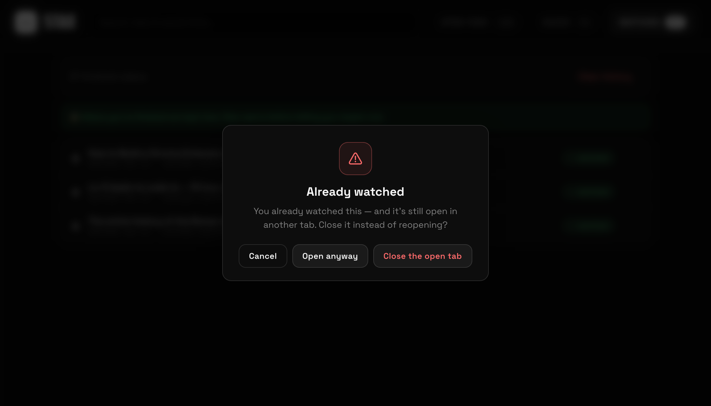
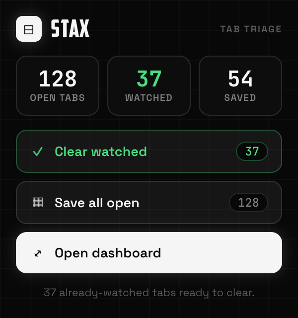
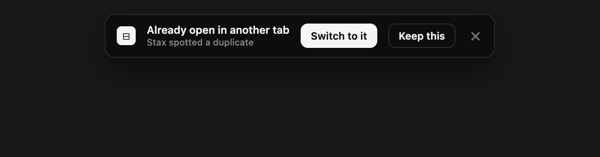

# ⊟ Stax

### The easy Chrome tab manager for people who drown in 100+ YouTube tabs.

Triage a wall of tabs, clear the videos you've already watched, stash the rest into
reopenable lists, and never accidentally open the same thing twice.

---

## Why Stax?

If your Chrome looks like a ransom note of YouTube tabs, the problem isn't *saving* them —
it's that **you've already watched half of them** and don't need them anymore. Stax knows the
difference. It reads how far you've played each video, lets you clear the finished ones in one
click, and keeps a memory so you never reopen something you've already seen.

No build step, no accounts, no servers. Everything lives locally in your browser.

---

## Features

### 🎯 Triage every tab from one page
A full-page dashboard of every open tab across all windows, **grouped by site** so your 63
YouTube tabs collapse into one row. Multi-select by checkbox or whole domain, then **Save**,
**Close**, or **Save & Close**.

### ✓ Already-watched detection
Stax reads each YouTube video's play position and tags it **✓ Watched** (≥90% played) or shows
a live `42%` progress pill. Hit **✓ Select watched** to grab every finished video at once, then
**Close** — no point keeping what you've already seen. Progress updates **live** as videos play,
no refresh needed.

### 🔒 Watched history + reopen guard
Every video you finish is remembered in a persistent **Watched** list. Try to reopen one and
Stax stops you with a warning — and if that video is *still open in another tab*, it offers to
**jump to the existing tab** instead of spawning a duplicate.

### 🚫 Duplicate-tab catcher (every site)
Open any page that's already open in another tab and Stax drops a banner into the new tab:
**Switch to it** (jumps to the original and closes the duplicate) or **Keep this**. Works
everywhere — address bar, links, search results. YouTube matches by video ID, so the same video
counts as a duplicate even if the URLs differ.

### ⚡ Quick popup
Click the toolbar icon for live counts (open / watched / saved) and one-tap **Clear watched**,
**Save all open**, and **Open dashboard**.

### 📦 Saved lists
Bundle tabs into named lists you can rename, **Open all**, open in a new window, or copy/remove
individually. Search filters open tabs *and* saved links instantly (`/` to focus). Undo the last
Save & Close, and export everything to JSON.

---

## Install (load unpacked)

1. Download or clone this repo.
2. Open `chrome://extensions`.
3. Toggle **Developer mode** (top-right).
4. Click **Load unpacked** and select the `stax` folder.
5. Click the Stax toolbar icon → the popup opens; hit **Open dashboard** for the full view.

No build, no dependencies.

---

## Chrome Web Store

Stax is packaged and ready to submit. The upload ZIP is attached to the
[latest release](https://github.com/StarkAg/stax/releases/latest), store screenshots and promo
tiles live in [`store/assets/`](store/assets), and the full copy-paste listing (description,
single-purpose statement, permission justifications, data disclosures) is in
[`store/STORE_LISTING.md`](store/STORE_LISTING.md). Privacy policy: [`PRIVACY.md`](PRIVACY.md).

---

## How it works

| Piece | Role |
|-------|------|
| `dashboard.html/.css/.js` | The full-page triage UI: open tabs, saved lists, watched history. |
| `popup.html/.css/.js` | Compact toolbar popup with counts + quick actions. |
| `background.js` | Service worker — first-run dashboard, and the cross-site duplicate-tab catcher. |
| `manifest.json` | MV3 config. |
| `fonts/`, `icons/` | Bundled Space Grotesk / American Captain / JetBrains Mono, and the logo. |

**Watched detection** injects a tiny probe into each YouTube tab that returns the current play
position *and* wires media events, so the tab **pushes** live progress (throttled) to the
dashboard — only actively-playing tabs emit updates, so 100+ tabs stay cheap. Finished videos
are recorded into `chrome.storage.local`, keyed by video ID.

**Duplicate detection** runs in the background worker on every page load, matching tabs by a
canonical key (video ID for YouTube, URL-minus-hash elsewhere) and bannering only the newer
copy.

---

## Design

Stax borrows the **GradeX** design language — a near-black `#080808` canvas with a 40px grid,
monochrome white-as-accent, and green/red used only for meaning (watched / danger). Typography
is **American Captain** for the wordmark, **Space Grotesk** for UI, and **JetBrains Mono** for
numbers and URLs. Fonts are bundled, so it looks identical offline.

---

## Privacy

Everything stays on your machine. Stax makes **no network requests** and has no backend. Saved
lists and watched history live in `chrome.storage.local`.

**Permissions:**
- `tabs` — read tab titles/URLs and open/close/switch tabs.
- `storage` — save your lists and watched history locally.
- `scripting` + `<all_urls>` — read YouTube play position and show the duplicate-tab banner on
  any site. Used only for those two things; nothing is sent anywhere.

---

## Roadmap ideas

- Auto-suspend idle tabs to free RAM
- Drag-to-reorder saved lists
- Configurable "watched" threshold
- Optional auto-close of watched duplicates (no prompt)
- A theme switcher (dark / light / amoled / navy / warm)

---

Built with Claude Code. Monochrome and proud.

